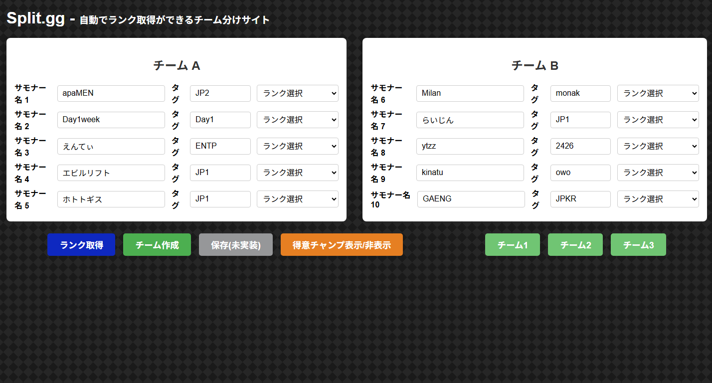
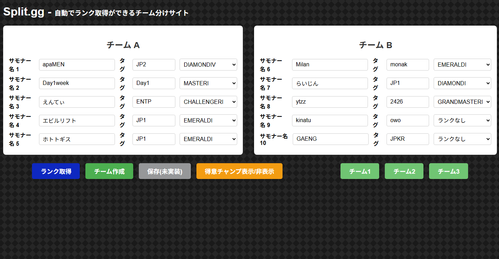
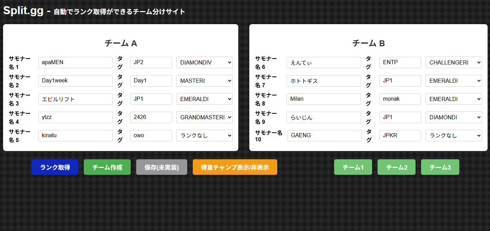
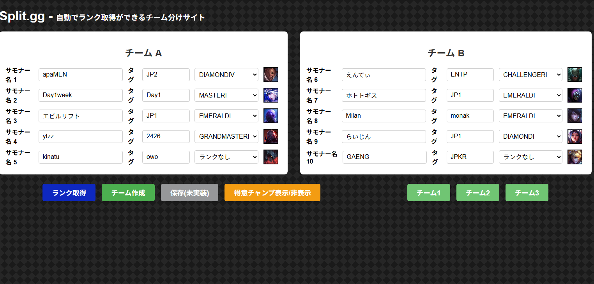

# README

# Split.gg  
League of Legends のカスタムルーム用に、プレイヤー情報を入力すると自動でチーム分けをしてくれる Web アプリです。  

---

## 📌 プロジェクト概要
このアプリは **Ruby on Rails の学習** を目的に開発しました。  
友人とカスタムゲームを遊ぶときに「チームのバランス調整が大変」という課題を解決するために、プレイヤーのランク情報を自動で取得・解析して、できるだけ均等なチームを作成します。  

※本アプリケーションは開発用APIキーを利用して実装を行っているため、24時間毎にAPIキーの更新が必要です。更新が無くてもプルダウンメニューからランクの選択及びチーム作成は可能です。

---

## 🎯 このアプリケーションのターゲット

- **League of Legends を友人やコミュニティで遊ぶプレイヤー**  
  - カスタムルームを立てるときに、手作業でチームを分けるのが大変だと感じている人  

- **公平なマッチを楽しみたいプレイヤー**  
  - ランクの差が大きく「一方的な試合になってしまう」ことを避けたい人  

- **LoL コミュニティのイベント主催者**  
  - 大人数のカスタムマッチでスムーズにチーム分けを行いたい人  

---

このアプリは、カジュアルに遊びたいプレイヤーから小規模イベントを運営する主催者まで、  
「誰でも簡単に・素早く・公平にチームを作成できる」ことを目指しています。

## 🚀 デモ
- 入力画面
  

- ランク取得後画面
  

- チーム作成後画面
  

- 得意チャンプ表示画面
  

---

## 📖 使い方

10人分のサモナー名とタグを入力

「ランク取得」ボタンを押すと Riot API からランク情報を自動入力

「チーム作成」ボタンを押すとサーバーで計算 → チーム結果を表示

---

### 💡 Tips
- ゲームの入室ログをそのままコピペできます！  

  例: 【サモナー名】 #【タグ】がロビーに参加しました。

  上記のログをサモナー名入力フォームに貼り付けると、自動的にサモナー名とタグが反映されます。

## ⚙️ 機能一覧

-10人分のプレイヤー情報入力フォーム

-Riot API からランク情報を取得し、セレクトボックスに自動反映

-チーム分けアルゴリズム（合計ランクが近いようにマッチング）

-非同期通信（ページリロードなしで結果を表示）

-得意チャンピオン表示（Riot API からのデータで分析。ボタンで切り替え可能）

---

## 📝 工夫した点

- **Rails コントローラーと JavaScript を連携**させ、非同期通信を基本に実装することで、ページをリロードせずにストレスフリーにチーム作成ができるようにしました。  
- Riot API へのリクエストを多数処理する必要があったため、**Thread を活用した並列処理**を導入し、待ち時間を削減しました。  
- チーム間の力のバランスを保ちつつ、常に同じ結果にならないようにするため、**最大3パターンのチーム構成を出力できるアルゴリズム**を実装しました。
- 更新頻度の少ない情報は、予めデータベースに保存することでRiot APIへのリクエスト数を少量化しました。

## 🔮 今後追加していきたい機能
現時点では、データベースを活用した機能が少ないため、学習も兼ねて以下を実装予定です。
- 「保存」ボタンを押すとチーム分けの結果をデータベースに保存し、いつでも呼び出せる「マッチ保存」機能
- リストから選んでサモナー名欄に瞬時にセットできる「お気に入りプレイヤー」機能
